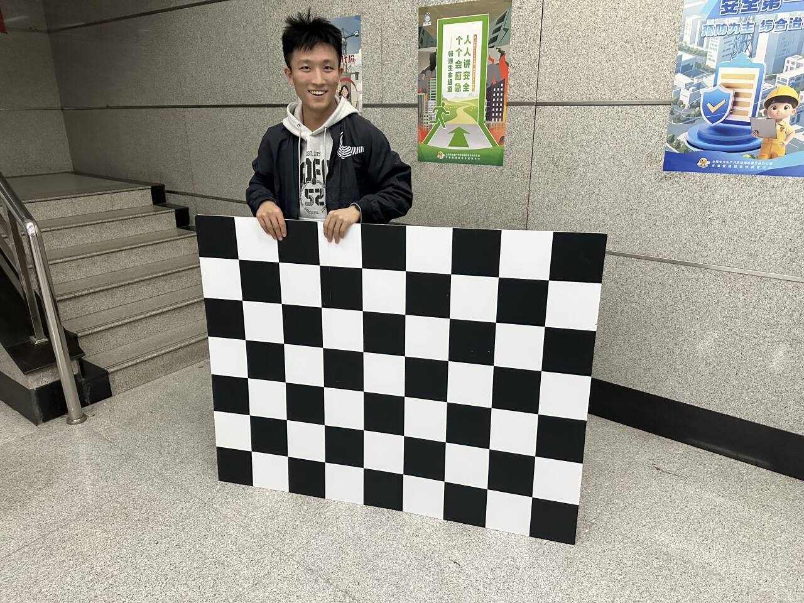
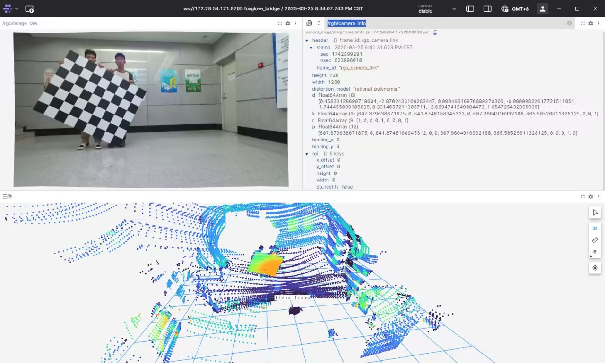
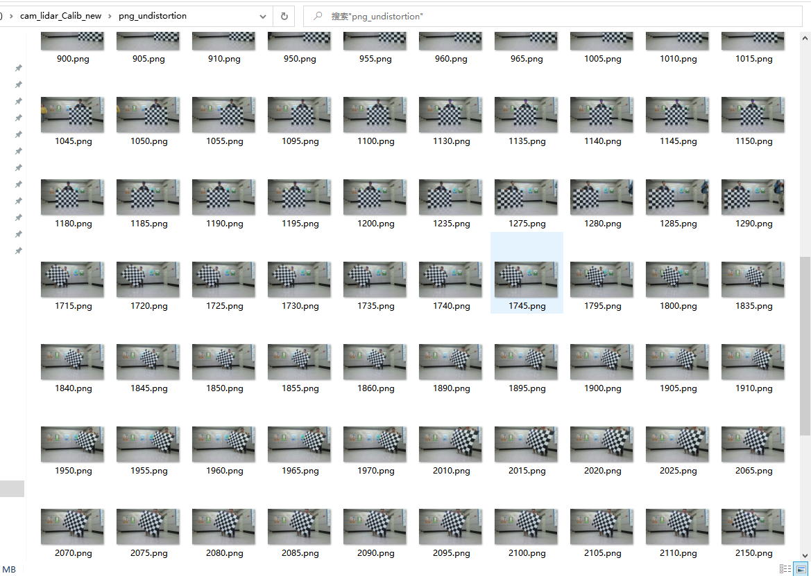
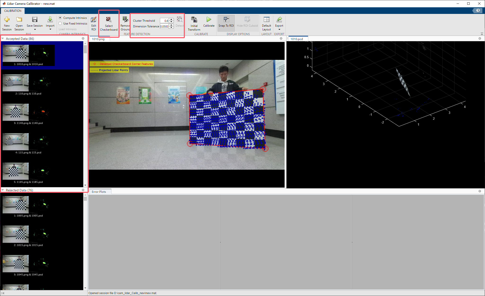
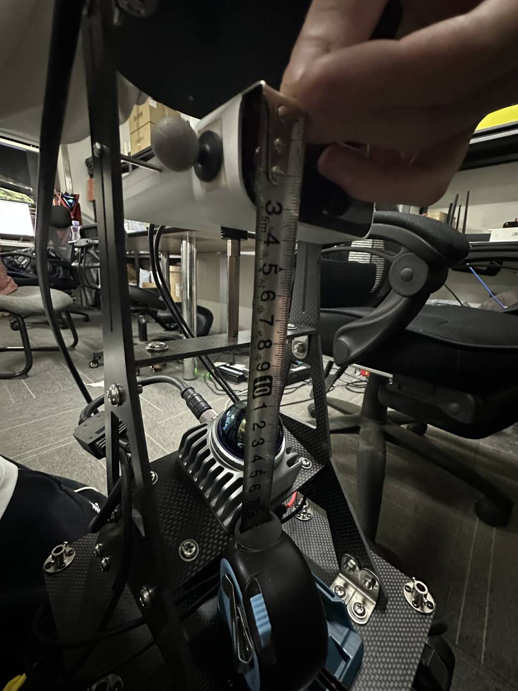
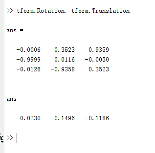
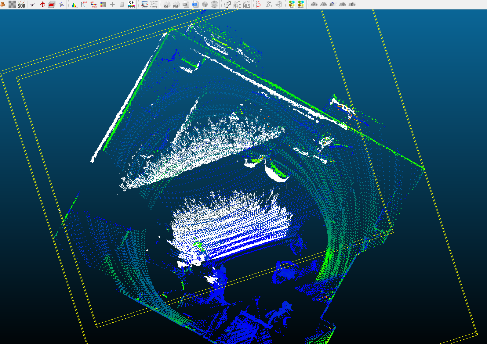
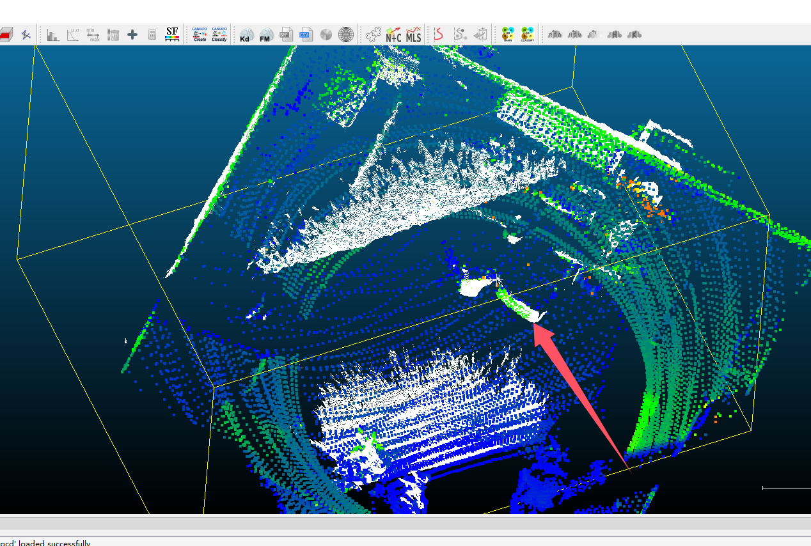
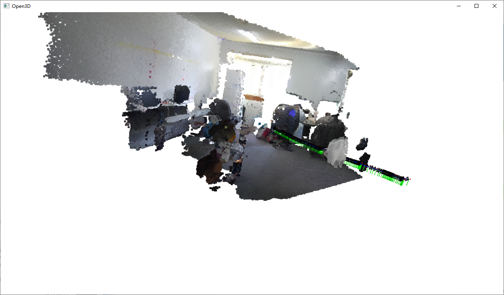

# Diablo机器人标定与定位真值计算指南

## 雷达与摄像头标定

采用Matlab的雷达相机标定工具：Lidar Camera Calibrator

### 数据采集

标定版制作，使用16cm大小的棋盘格，规格是7*9，不能有任何白边，如图所示



采集时，需要同时采集雷达的点云数据（图下面板），以及摄像头的数据（图左上面板），我们使用的Azure Kinect2相机出厂自带内参（图右上面板），因此不用单独标定摄像机



我们录制了一个ros2的话题包，接下来开始数据处理

### 数据处理

数据处理需要我们从ros2包中导出点云以及图像数据，然后使用matlab进行标定。

要阅读导出代码，请浏览该项目目录下的`lidar_cam_calib_rosbag_exporter`目录，该节点将对相机以及深度相机还有雷达点云进行时间戳同步，然后考虑到我们使用的livox雷达点云的稀疏性，会累计3帧的雷达点云测量合并为一个pcd(因此在这三帧内，应该避免标定板有巨大的运动)。

最终我们将得到若干张rgb图片，深度图片和pcd点云文件，然后我们需要手动挑选出一些没有模糊，标定板在当前帧没有巨大位移的帧，用于matlab的标定，如图所示



matlab的工具不支持对图片进行去畸变处理，我们需要手动的先将图片进行去畸变，我们直接从Azure Kinect相机驱动发布的话题读出畸变参数，然后使用本项目目录下`calib_image_undistortion.py`，修改其中的内参与畸变参数即可实现去畸变

接下来我们需要滤除pcd文件里面的其他杂点，以实现matlab更好的识别标定板所在的平面，请参考本项目目录下`filter_pcd_cpp`文件夹下的代码，并使用`CloudCompare`工具手动确认标定板的折射率与周围环境的折射率的明显区别，然后使用改程序尽可能过滤掉除了标定板外地其他点。

### matlab 标定

然后此时得到两个文件夹，一个`png_undistorion`得到的是已经被去畸变过后的rgb图像，一个`pcd_filtered`得到的是已经滤除杂点的pcd文件，此时可以导入进matlab中进行标定



如上图所示，导入后，请根据你的雷达自身的点云密度设置Cluter Threshold和Tolerance，第一个参数指定聚类平面的点之间的距离最大是多少，如果你的激光雷达点比较稀疏，那么就调大这个值，第二个参数指定对于识别到的点云团的非平面程度耐受度为多少，如果质量较差的点云，则调大这个值，然后点击Detect进行重新识别平面

另外可以切换到Select Chessboard界面手动的框选棋盘格的点云有哪些

然后需要给matlab一个初始的变换来让他能优化的比较好，此时可以手动量取大概的位移，然后使用python计算大概的旋转矩阵，此处不做赘述。



这样我们能够使用matlab测量出一个大致准确的外参，该4x4矩阵的含义是：**摄像机坐标系下的点经过这个变换，可以变到雷达坐标系下。**



### ICP精确标定

matlab标定的结果仍然有一定的误差，同时我们不能保证搭载在机器人上的RGBD摄像头的位置一定不会发生变化，可能长期的震动以及自身重量会让摄像机与雷达的外参发生一定的变化，此时就需要使用ICP算法进行精确的对齐

对齐原理是：Azure Kinect 2深度相机已经完成了搭载RGB和Depth图像的对齐，而我们可以通过Depth图采样点云，这样就能够和雷达的点云进行ICP对齐（用matlab的结果作为初值），通过对齐可以知道Depth和雷达的外参关系，也就知道了相机和雷达的外参关系。

具体实施上，请参考该项目的`ros2_lidar_camera_auto_calibrate`文件夹，该代码订阅了深度相机话题和雷达的话题，并在收到第一帧时间同步的有效帧后开始对齐二者，然后发布一个位姿话题表示雷达和相机的外参关系。我们可以在每次机器人采数据集之前，都将机器人放置在一个特征丰富的场景，使用ICP算法进行对齐后，再采集后续数据，保证外参的精确性。

ICP精准对齐前（可以看到墙面对齐不是特别好）：



ICP精准对齐后（墙面对齐精确，物体也吻合得特别好）：



## 雷达定位的位姿到摄像头的位姿

我们使用雷达运行SLAM算法来获得在室内的定位，然后建图时我们希望得到摄像头的精确位姿，因此根据我们之前标定的雷达与摄像机的外参矩阵，就可以在知道雷达位姿的情况下，得到相机的位姿，具体过程如下：

### 公式

我们上述计算的外参矩阵的含义，是将摄像机坐标系下的点变换到雷达坐标系下的点，需要的变换矩阵， 因此如果已知了雷达位姿，就可以通过右乘一个外参矩阵得到相机的位姿，即：

$$
T_{camera} = T_{lidar} * T_{CameraToLidarMmatrix}
$$

### 存在的问题

我们现在使用的定位算法在刚运行时，会使用雷达上搭载的imu进行一次调平操作，即计算一个变换矩阵，使得雷达采集到的点云经过这个变换矩阵后，在刚开始一定是地面水平的。

该变换矩阵我们命名为 `init_gravity_matrix`

由于存在这样一个矩阵，因此我们使用SLAM算法得到的位姿，并不是雷达真实的位姿，需要和`init_gravity_matrix`进行一定运算才能得到真实位姿

### 导出实时定位数据集

我们现在使用diablo机器人，在运行SLAM算法的情况下录制了一段包，该包包含了RGBD图像数据， `init_gravity_matrix`的值，以及估算的自己的实时位姿

接下来请阅读本项目目录下`diablo_lidar_dataset_generator`源码，该源码将时间同步RGBD图像数据以及估算的自身位姿值三个话题，然后输出到指定目录，同时还会将初始的`init_gravity_matrix`的值输出到指定目录，此处导出的所有位姿的旋转都是以四元数形式导出，且顺序都是 (w, x, y, z)

### 完成相机位姿真值计算

接下来，我们先使用之前标定的外参矩阵，将雷达位姿转换成摄像机位姿（注意此时我们还没有修正调平矩阵`init_gravity_matrix`带来的偏差）。

阅读该项目目录下`quat_to_matrix.py`代码，可以将雷达位姿的四元数形式转换成4x4矩阵形式

然后再运行目录下`lidar_pose_to_camera_pose.py`代码，可以将雷达位姿矩阵转换成摄像机的位姿矩阵

此时你可以使用`draw_traj.py`工具，可视化的查看经过调平矩阵（`init_gravity_matrix`）影响的轨迹是什么样子的

然后使用`fix_gravity_matrix.py`工具，可以将刚才输出的相机位姿进行矫正，修复`init_gravity_matrix`的影响，注意将下面值填写成你真实采集数据包里的重力位姿：

```python
qw, qx, qy, qz = 0.98477, -0.000886997, 0.173858, 0.000156597
```

然后就可以使用可视化工具来查看轨迹是否准确了，使用`visualize_point_map.py`即可可视化查看校正后的轨迹投影在空间中是否准确。




至此，摄像头的位姿真值就已经拿到，就是`camera_pose_matrix_fixed.txt`文件中所包含的内容。